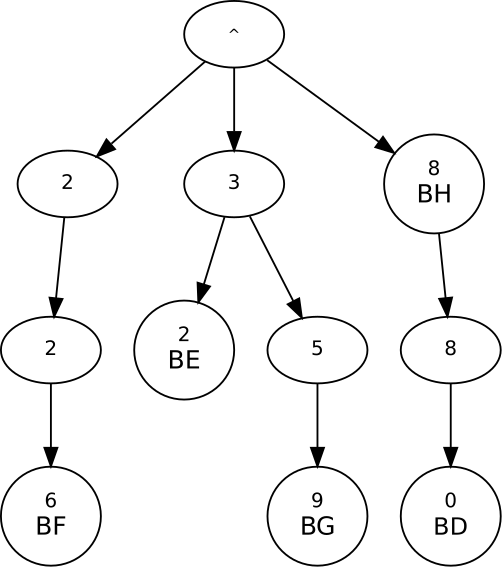

# CountryCodes

This post is ... discussion on performance considerations in implementation.

## Problem description

Every now and then some of my peers and I come up with random programming
challenges for ourselves. This time the task was to write the fastest country
code finder. That is, given a list of country codes and a collection of phone
numbers, determine which country each phone number belongs to.

The country code is always the first few digits of the phone number. This is a
type of string matching problem where we want to find the country code that is
equal to the first few digits of the phone number. If a phone number matches
multiple country codes then the longest match should be chosen.

The list of country codes used can be found at http://country.io/phone.json.

## Strategies

A few observations on the problem. First and foremost, both the country codes
and the phone numbers are numbers but that doesn't mean that we have use a
number type, such as `int` or `long`, to store them in memory. In fact, it is
most likely better to store them as strings. We're not interested in arithmetic,
we're doing string matching.

Both the country codes and the phone numbers are short. There are many string
searching algorithms, but the ones I know about are designed for finding a
search string somewhere in a long text. I this case we know where the sought
string should be; at the very start. Moreover, we have many country codes to
search for and also lots of phone numbers to search in.

An important observation is that the the set of country codes is constant
throughout the application's lifetime. This means that whatever work we can do
at startup to speed up the queries is worth it since the cost of the initial
work will be amortized by the large number of queries. Within reason, of course.

### Linear search
There are a number of ways to approach this. Arguably, the simplest way is to
keep all the country codes as a list of strings and for each given phone number
loop over the country codes until a match is found. This works, but is probably
not very fast. It does `O(c*d*p)` digit comparisons where `c` is the number of
country codes, `d` is the average number of digits in a country code and `p` is
the number of phone numbers tested.

Note that the problem description dictate that we find the longest country code
that matches. We should therefore sort the list by longest first so that we know
that the first match is also the longest one.

### Binary search
Whenever we see a linear search through a collection of sortable elements we
should consider sorting the data and replace the linear search with a binary
one. This reduces the number of digit comparisons from `O(c*d*p)` to
`O(log(c)*d*p)`. This is better, when testing a given phone number a whole slew
of country codes is not even looked at anymore. The `d*p` part may seem scary,
but remember that `d` is small and we do need to look at every digit of a country
code in order to accept or reject a potential match. I have not been able to
find a way around that.

### Hash table
While `log(k)` isn't too bad, we can do better still. A common way to do
constant time lookups is to use hashing. We insert each country code into a hash
table and for every given phone number we first test if the single digit prefix
substring can be found in the hash, then we test the leading two digits, and
then three and so on until we find a country code or the leading substring is
longer than the longest country code. This algorithm is `O(d*p)` digit
comparisons.

### Trie
I have not been able to find or come up with something better than `O(d*p)`, but
I have found an alternative data structure that gives the same `O`. A
[Trie](https://en.wikipedia.org/wiki/Trie), also called a prefix tree, is a tree
used to store data where the location in the tree, i.e., path from the root to
the containing node, defines the key that the data it associated with. An
example is in order.

Assume that we are given the following country codes:

- "BD": "880"
- "BE": "32"
- "BF": "226"
- "BG": "359"
- "BH": "8"


This is the resulting trie:



A few things to note. First, the root node contains "^", which is used to denote
the start of a string. Secondly, data may appear not only in the leave nodes,
but in internal nodes as well. Third, some nodes doesn't contain any data. They
exist only to define the path to the data contained in the node's children.
Lastly, to find the country code of a number we walk down the trie as dictated
by the first few digits of the number and stop as soon as we find a non-empty
node.

### A note on caches

Caches are all the rage these days. The ever widening processor-memory
performance gap is making memory accesses more and more expensive in terms of
CPU cycles. This has made cache-friendly access patterns more important than
ever. I will discuss the memory access patterns for each implementation strategy
later in this text.

However, in addition to the access patterns, the size of the working set must be
taken into account as well. The input file, http://country.io/phone.json, is 3.3
KB and it is reasonable to believe that storing the data in memory will use a
comparable amount of space. The CPU I'll be testing on has 16 KB of L1 data
cache per core. This means that we can put the entire data set into L1 cache and
still have plenty of room left for whatever acceleration structure we choose.


## Assumptions

When striving for the fastest possible implementation it is important to
identify unspecified details in the problem description and chose whatever
interpretation that allows for the fastest implementation. In this case I have
made the following assumptions:

    - If a phone number matches multiple country codes of equal length, then any
      one of them may be returned.
    - All phone numbers have the the same length, 8 digits.
    - Phone numbers may be created randomly.

## Linear search

The linear search algorithm is implemented in `LinearSearch.cpp` and is as
straightforward as it gets. A `vector` contains the `(country code, country id)`
pairs, sorted by code length, and a number lookup simply iterates over the
vector and for each country compares the current phone number with the country
code digit by digit until the first match is found.

Central to this method is the implementation of

```c++
bool startsWith(char const * number, std::string const & code)
```
*Signature of code testing function.*

which determines if a given `number` starts with the given country `code`. We
start with the most natural implementation, which is a call to `std::mismatch`.
This is a standard library function that returns the point at which two ranges
first differ. In our case it tells us where the number no longer matches the
country code. If the algorithm is unable to find any mismatch then the country
code is a prefix of the number and we have found our country.

```c++
auto mismatchPoint = std::mismatch(begin(code), end(code), number);
return mismatchPoint.first == end(code);
```
*Implementation using the standard library method `mismatch`.*

Trying to improve upon the standard library implementation, we write the digit
testing loop manually. First using a `for each` loop:

```c++
for (auto c : code) {
    if (c != *number)
        return false;
    ++number;
}
return true;
```
*Implementation using a for each loop over the digits of the code.*

and secondly we implement this loop in a C style fashion as follows.

```c++
char const * c = code.c_str();
while (*c != '\0' && *c == *number) {
    ++c;
    ++number;
}
return *c == '\0';
```
*Implementation using C construct only.*

These three implementations are very similar. They all use the end of `code` as
their stop condition, they must all increment the `number` pointer on every
iteration, and they all do a `char` comparison as an early-exit condition. One
might expect that they would perform equally.


They didn't.

Let's figure out why. First up is `perf stat`.

```
 Performance counter stats for './mismatch':

         60,477683      task-clock:u (msec)       #    0,991 CPUs utilized          
                 0      context-switches:u        #    0,000 K/sec                  
                 0      cpu-migrations:u          #    0,000 K/sec                  
               121      page-faults:u             #    0,002 M/sec                  
       223 195 029      cycles:u                  #    3,691 GHz                      (80,17%)
        17 145 522      stalled-cycles-frontend:u #    7,68% frontend cycles idle     (80,16%)
        29 415 275      stalled-cycles-backend:u  #   13,18% backend cycles idle      (40,64%)
       421 523 844      instructions:u            #    1,89  insn per cycle         
                                                  #    0,07  stalled cycles per insn  (55,22%)
        90 662 947      branches:u                # 1499,114 M/sec                    (68,44%)
         2 856 340      branch-misses:u           #    3,15% of all branches          (81,67%)

       0,061041527 seconds time elapsed
```
```
Performance counter stats for './for_each':

        172,374141      task-clock:u (msec)       #    0,998 CPUs utilized          
                 0      context-switches:u        #    0,000 K/sec                  
                 0      cpu-migrations:u          #    0,000 K/sec                  
               121      page-faults:u             #    0,702 K/sec                  
       657 547 329      cycles:u                  #    3,815 GHz                      (83,65%)
       287 710 712      stalled-cycles-frontend:u #   43,76% frontend cycles idle     (83,78%)
         7 485 469      stalled-cycles-backend:u  #    1,14% backend cycles idle      (33,08%)
       308 331 340      instructions:u            #    0,47  insn per cycle         
                                                  #    0,93  stalled cycles per insn  (49,33%)
        69 781 078      branches:u                #  404,823 M/sec                    (65,57%)
         2 822 864      branch-misses:u           #    4,05% of all branches          (81,80%)

       0,172803061 seconds time elapsed
```

From top to bottom. `task-clock` is the amount of wall clock time that the
process was on the CPU. It is expected to be higher than the timing measurements
done by the application itself since the `task-clock` time also includes the
startup time. Next is `context-switches` and `cpu-migrations`. We're running a
really short program on a lightly loaded machine, so we expect both of these to
be zero.

Page faults are costly, so we really want to minimize them. In fact, our memory
working set is so small that I don't see why we would get any at all, once the
number processing has started. So why 121? A sure source of page faults is the
loading of the application itself. How many page faults should we get by simply
loading the application into memory? The size of the binaries on disk is 370K
and with a page size of 4k we would get 95 page faults. The remaining 26 are
probably from loading various libraries due to the usage of the standard library
and from the initial setup done by the application. 121 page faults seems
reasonable.

Another way to verify that the main loop doesn't trigger any page
faults is to increase the number of phone numbers tested.
```
Performance counter stats for './mismatch_100k':

              121      page-faults:u
       0,064132723
```
```
Performance counter stats for './mismatch_500k':

              121      page-faults:u
       0,840972279 seconds time elapsed
```
We see that the wall time increased but the page faults did not, thus the main
loop is page fault free.

A third way is to use a profiler to record where the page faults happen. We can
use `perf record` for this. I run perf with `perf record -c 1 -e page-faults -g
./mismatch` to capture the call stack (`-g`) to every (`-c 1`) page fault (`-e
page-fault`) when running `./mismatch`. Viewing the results with `perf report
-n` lists a whole bunch of `_dl_sysdep_start`, `_dl_relocate_object`,
`_dl_map_object`, and similar. That's the loading alright. Digging in a bit
deeper, into the annotated assembly, I find three page fault in `fillCountries`,
one in the random number generator constructor, one in the random data filler
and one in the random number generator. The first and the last two are expected
since they all, the first time they run, process a bunch of newly allocated
memory. The one in the constructor happens, I believe, because the on-stack
allocation of the `Random` object causes the stack to grow past a page boundary.
The details are unclear. The `Random` class contains an internal buffer of
random bytes that is pre-fills. This buffer is 2048 * 4 = 8192 bytes, or 2
pages. Thus filling it must generate at least two page faults. Most likely it
won't be page boundary aligned so we'll get three, as was reported by `perf`.
The `std::vector` holding the country data contains 246 elements each requiring
40 bytes. This totals 9840 bytes, which is a bit over two pages. The three page
faults in `fillCountries` are thus explained.

Next in the perf output is cycles. The run using `std::mismatch` measured
223,195,029 cycles while the one using the for-each loop used 657,547,329. Since
the application is heavy on computation and does very little IO the cycle count
is basically a measure of time. The large difference is expected since the
application timers reported lower throughput for the for loop, and therefore it
consumes more cycles, but `perf` doesn't give any hints as to why that is.

Next up is `stalled-cycles-frontend` and here we get to the interesting part.
The `std::mismatch` version has 17,145,522 stalled cycles which perf report as
7.68% of all cycles. The for-each version has 287,710,712, or 43,76%, cycles
stalled in the front end. That's significant. If correct, the CPU is doing
nothing almost half of the time. There are a number of reasons for why the CPU
may stall. It may be waiting for the next instructions to be loaded from memory,
a long-latency instruction to finish, or for a data dependency to be resolved.

Inspecting the assembly may provide some answers. The following two listings are
taken from `perf report` after recording `stalled-cycles-frontend` events using
`perf`. Each row represents an instruction in the program binary. The first
column is the number of `stalled-cycles-frontend` samples taken at that
instruction, the second column, which is mostly empty, are byte offsets used by
jump instructions. The third column is the instruction itself and what remains
on the row are the arguments to the instruction.


```
Inner loop, mismatch:

121 │250:┌─→movzx  ebx,BYTE PTR [rdx+rbp*1]
418 │    │  movzx  edi,BYTE PTR [rax+rbp*1]
 32 │    │  cmp    edi,ebx
    │    │↓ jne    270
 21 │    │  inc    rbp
418 │    │  cmp    rcx,rbp
    │    └──jne    250
    │     ↓ jmp    290  
```


```
Inner loop, for_each:

5724 │250:┌─→movzx  ebx,BYTE PTR [rdx+rbp*1]
7785 │    │  movzx  r15d,BYTE PTR [rax+rbp*1]
     │    │  cmp    r15d,ebx
     │    │↓ jne    270
 133 │    │  inc    rbp
 921 │    │  cmp    rcx,rbp
     │    └──jne    250
   4 │     ↓ jmp    280
```

Both surprisingly and unsurprisingly, they are virtually identical.
Unsurprisingly because that was our initial guess. They do the same work, so why
would different instructions be generated? Surprisingly because we see so very
different performance characteristics.

A walkthrough of the code snippets. Remember the original C++ code.

```c++
auto mismatchPoint = std::mismatch(begin(code), end(code), number);
return mismatchPoint.first == end(code);
```
*Implementation using the standard library method `mismatch`.*

```c++
for (auto c : code) {
    if (c != *number)
        return false;
    ++number;
}
return true;
```
*Implementation using for-each loop.*


They both start with loads of a pair of bytes from memory into a pair of
registers. This is loading `c` and the dereferencing of `number` in the C++
code. The mismatch version loads into `ebx` and `edi`, while the for-each
version loads into `r15d` instead of `edi`. All general purpose registers, so I
don't see any reason for a performance difference yet. `rdx` and `rax`, used in
the address calculation, presumably holds pointers to the starts of the two
strings we are comparing, and `rbp` holds the index of the characters we are
currently comparing. After the loads the two newly filled registers are compared
using `cmp` and if not equal we jump (`jne`) out of the loop. This is the `if (c !=
*number) return false` part of the C++ code. Next `rbp` is incremented. Since
`rbp` is used in both loads, this single instruction does both the increment of
`number` and the iterator increment hidden inside the for-each loop header.
After the increment a second comparison is made. This comparison tests if `rbp`
has reached the end of the string, which was, presumably, previously stored in
`rcx`. If not equal, i.e., there are more characters to test, then the program
jumps back to the start of the loop.

Since the generated assembly code is so similar between the two version, the
reason for the performance difference must lie somewhere else.

Let's expand the assembly listing a bit. To understand the following we first
need to take a look at the surrounding C++ code. The method containing the inner
loop is called from a method named `getCountry`:

```c++
CountryId getCountry(char const (&number)[9]) {
    for (auto & country : m_countries) {
        if (startsWith(number, country.code)) {
            return country.id;
        }
    }
    return not_found;
}
```
*getCountry*

`CountryId` is a struct containing a two element char array and `not_found` is a
`constexpr CountryId` having `'\0'` in both array slots. This is the part of the
code that makes this implementation a linear search.

`getCountry` is called from `main` in a loop with the following layout:

```c++
for (int i = 0; i < numIterations; ++i) {
    common::genrateNumbers(numbers, random);
    for (auto const & number : numbers) {
        CountryId country = phoneBook.getCountry(number);
        if (country.id[0] != 0) {
            ++numMatches;
        }
    }
}
```
*Main loop*

In the above, `numbers` is declared as `std::array<char[9], numbersPerIteration>
numbers;`, `numIterations` is 100 and `numbersPerIteration` is 1000. That is,
for each outer iteration we first generate a thousand phone numbers and then
check them one by one. We do this one hundred times. The second argument to
`generateNumbers`, `random`, is a pseudo-random number generator that is
discussed in a separate section.


```
mismatch:

    │       mov    r8,QWORD PTR [rsp+0x4350]   // Load 8 bytes from memory.   two pointers to 8     Is this the
  1 │       mov    r13,QWORD PTR [rsp+0x4358]  // Load 8 bytes from memory.   byte values perhaps?  std::array?
    │       cmp    r8,r13                      // Check if the two values just loaded are equal.
    │       lea    rdx,[rsp+0x2028]            // Load a completely different value from memory.
    │     ↓ jne    230                         // lea sets no flags, so jne for r8, r13.
    │223:┌─→movzx  eax,BYTE PTR [r11+0x20]     // Was r8, r13 was equal. Load a byte from memory.
    │    │↓ jmp    295                         // Jump past loop.
    │    │  nop                                // NEVER REAHCED.
    │230:│  mov    r11,r8                      // Copy r8 (pointer?) to r11.
 47 │233:│  mov    rax,QWORD PTR [r11]         // Dereference the pointer. rax = *r11.
  6 │    │  mov    rcx,QWORD PTR [r11+0x8]     // Dereference the pointer. rcx = *(r11 + 1)
    │    │  test   rcx,rcx                     // Did the second dereference find a zero?
 79 │    │  mov    ebp,0x0                     // ebp = 0.
 52 │    │  mov    r14,rax                     // 
  2 │    │↓ je     276
    │    │  nop
129 │250:│  movzx  ebx,BYTE PTR [rdx+rbp*1]
390 │    │  movzx  edi,BYTE PTR [rax+rbp*1]
 29 │    │  cmp    edi,ebx
    │    │↓ jne    270                      // Found mismatched character, return false.
 26 │    │  inc    rbp
440 │    │  cmp    rcx,rbp
    │    │↑ jne    250
    │    │↓ jmp    290
    │    │  nop
 93 │270:│  add    rbp,rax
111 │    │  mov    r14,rbp
 42 │276:│  add    rax,rcx
  3 │    │  cmp    r14,rax
 88 │    └──je     223
 70 │       add    r11,0x28
 89 │       cmp    r11,r13
 37 │     ↑ jne    233
    │       xor    eax,eax
    │     ↓ jmp    295
    │       nop
 38 │290:   movzx  eax,BYTE PTR [r11+0x20]
  3 │295:   cmp    al,0x1
    │       sbb    r15d,0xffffffff
    │       add    rdx,0x9
    │       cmp    rdx,r10
    │     ↑ jne    230
    │2a4:   inc    r9d
  1 │       cmp    r9d,0x64                 // 0x64 == 100. We do 100 generate-test iterations.
    │     ↑ jne    e0                       // Restart outermost loop, i.e., generate a new set of numbers.
```

The implementation uses `std::string` for storing the country codes. This may be
sub-optimal since `std::string` stores its data on the heap and because of this
moving from from one country code to the next results in a random jump in
memory. Fortunately, country codes are short and we therefore benefit from the
small string optimization that is provided by many standard library
implementations. Different implementations have made different decisions on what
constitutes a *small string*, but according to
http://info.prelert.com/blog/cpp-stdstring-implementations the limit is at least
15 characters for the most common implementations. Our phone numbers are only 8
digits and the country codes are even shorter, so we're good.

We can save a few bytes per string by rolling our own packed string array
format. A `std::string` is 32 bytes on my compiler and the average country code
length is about 3 bytes, but I doubt it will make linear search competitive with
the other algorithms.


## Binary search

To allow for binary search through a data set the data must be ordered so that
we can look at any element and determine on which side of that element the
sought element must reside. In our case a regular alphabetical ordering achieves
just that. One complicating factor is that a phone number may match several
country codes and we must find the longest one. But the alphabetical sorting
will at least place all such country codes next to each other so when the first
match is found we can do a linear search forward for the last code that matches.

## Hash table(s)

[//]: # "Note on perfect hashing since we have a fixed set of country codes."

## Trie

## Common utilities


[//]: # "Comment."
